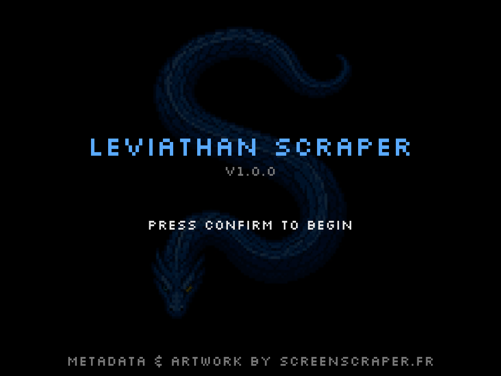
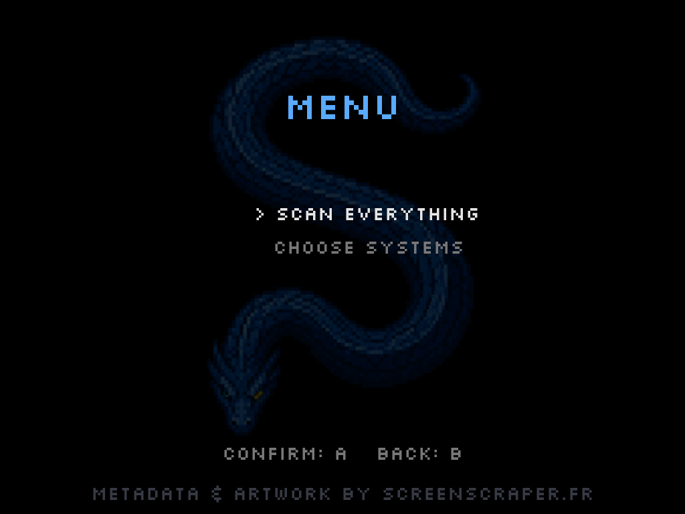
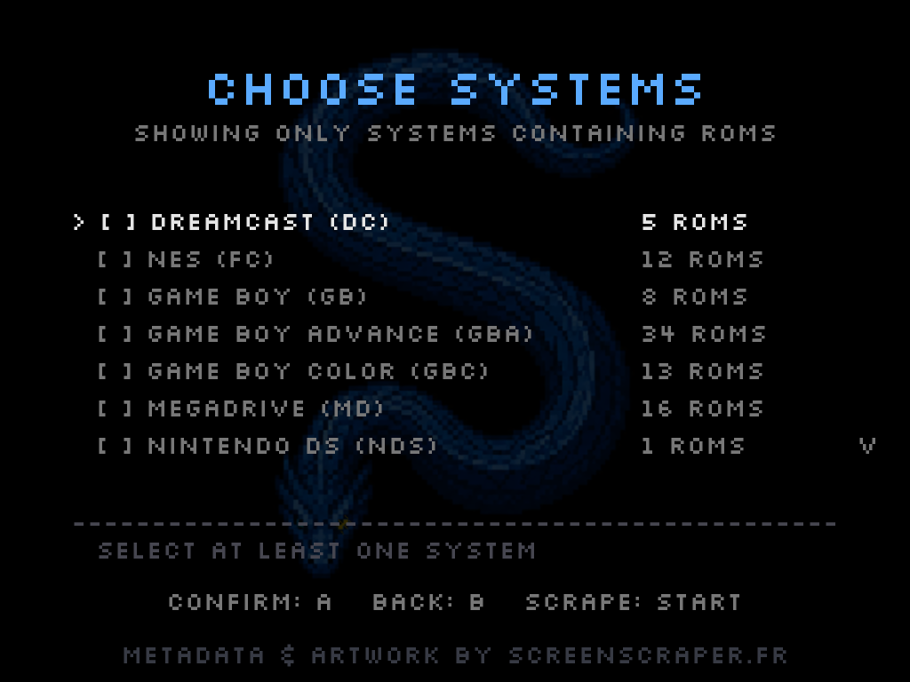
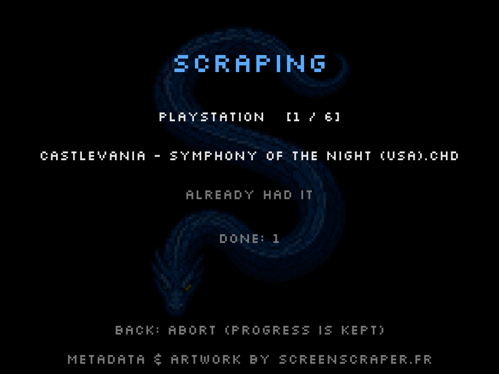
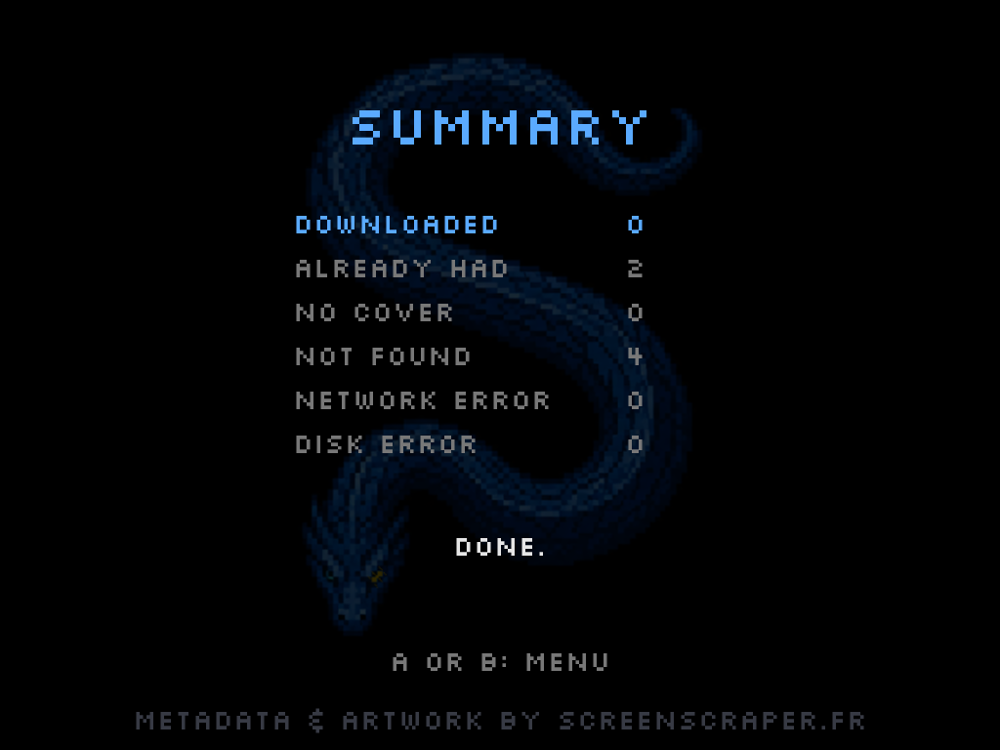
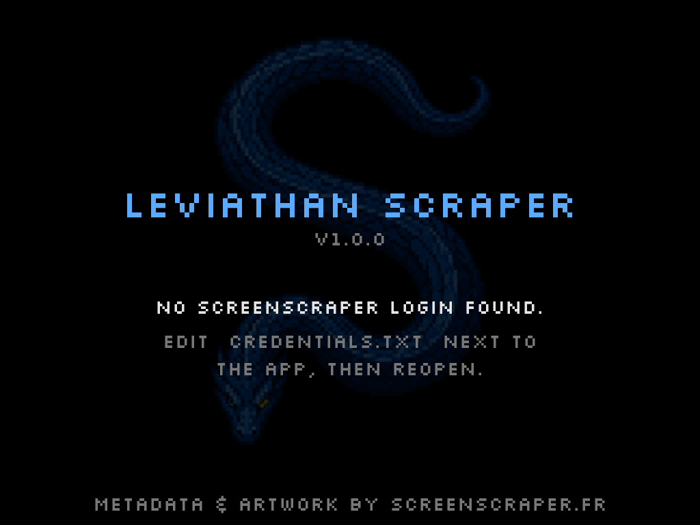

# Leviathan Scraper

Box art scraper for the **Trimui Brick Pro**. It reads your ROM collection,
looks each game up on [ScreenScraper.fr](https://www.screenscraper.fr), and
writes the cover art where the stock OS displays it — no PC, no manual
downloading, all on the handheld itself.



---

## Contents

- [For users](#for-users) — install it and scrape your covers
- [For developers](#for-developers) — build it from source
- [About this project](#about-this-project)
- [Credits](#credits)
- [License](#license)

---

## For users

There is nothing to compile. Setup is two small steps: drop the app folder onto
the SD card, and put your ScreenScraper login into one text file. However you
normally manage files on your device (reading the SD card on a computer,
copying over the network, or a file manager on the device itself)... it's fine.

### What you need

- A **Trimui Brick Pro** running the stock OS.
- A **free ScreenScraper account** — register at
  [screenscraper.fr](https://www.screenscraper.fr/membreinscription.php).
  The scraper uses your own account, so your daily download allowance is
  yours alone.

### Install

1. Download the latest release `.zip` from the
   [Releases page](https://github.com/du-aite/leviathan-scraper/releases).
2. Unzip it. You get a folder named `Leviathan`.
3. Copy that whole `Leviathan` folder onto your SD card, under
   `Apps` — so it ends up at `/mnt/SDCARD/Apps/Leviathan`.

### Add your login

Inside the `Leviathan` folder there is a file called **`credentials.txt`**.
Open it in any text editor and replace the two placeholders with your own
ScreenScraper username and password:

```
ssid=your_username
sspassword=your_password
```

Save the file. That is the only thing you ever edit.

### Run it

Launch **Leviathan Scraper** from the Apps menu on the device. From the main
menu you can scan everything at once or pick which systems to cover.



Choose the systems you want — only the ones that actually contain ROMs are
shown — and press start.



Let it run. It pauses politely between lookups, so a large collection takes a
while, and it skips any game whose cover you already have. You can stop at any
time without losing what was already done.



When it finishes you get a summary of what happened. Refresh your ROM list in
the stock OS and the covers appear.



If you open the app before editing `credentials.txt`, it tells you so on the
first screen and waits — nothing is sent anywhere until your login is in place.



### Notes

- Covers are written to `/mnt/SDCARD/Imgs/<SYSTEM>/`, which is where the stock
  OS looks for them.
- Arcade systems (MAME, FBNeo, NeoGeo, CPS, etc.) are **not** covered in this
  version — their ROMs are zipped and hash differently. Support for them is
  planned for a later release.
- When you update the app later, be careful not to overwrite your edited
  `credentials.txt` with the blank one from a new release.

---

## For developers

The app is written in **C with SDL2**, cross-compiled for the Brick's aarch64
CPU. If you just want to use it, see [For users](#for-users) above — you do not
need any of this.

### Credentials, the two kinds

There are two separate logins, and they live in two different places on purpose:

- **Developer credentials** (`devid` / `devpassword`) identify the *program* to
  the ScreenScraper API. They are compiled into the binary. To build from
  source you need your **own** developer credentials — request them from the
  ScreenScraper team; do not reuse someone else's.
- **User credentials** (`ssid` / `sspassword`) are each person's own account.
  These are **not** compiled in — they are read at runtime from
  `credentials.txt`, so a user can change them without recompiling.

### Configure

```sh
cp src/config.h.example src/config.h
```

Then fill in your developer `devid` / `devpassword` in `src/config.h`. This file
is gitignored and must never be committed — it holds secrets.

### Build

Two targets, two worlds:

```sh
# Native build, for quick testing on your own machine (macOS / Linux):
make native

# Cross-compile for the Brick — MUST run inside the aarch64 toolchain container:
make brick

# Assemble the release folder (binary + assets + credentials.txt template):
make release
```

`make native` runs on your computer. `make brick` only works inside the
cross-compilation container — running it outside builds for the wrong CPU and
the device rejects the binary. See the build notes for the container setup.

### Dependencies

- **SDL2**, **SDL2_ttf**, **SDL2_image**
- **libcurl** — on the device, linked against the Brick's own older library, so
  it matches what exists at runtime.
- A **CA certificate bundle** (`cacert.pem`) is shipped with the app, because
  the device has no system certificate store.

Some things the repository does not carry and you fetch yourself: the device
libraries, and the Go reference implementation used during development. Binaries
and build output are gitignored.

---

## About this project

This was built with the help of AI (Claude), **thoroughly** reviewed by me — a
software developer. Made with love, from users to users.

When I started this, I couldn't find a scraper app for the Trimui Brick Pro
running the stock OS, so I built the one I wanted to use. If it helps you get
your collection looking good, it did its job.

---

## Credits

Metadata and artwork are provided by **[ScreenScraper.fr](https://www.screenscraper.fr)**.
Leviathan Scraper is a client for their API and would not exist without their
database and the community that maintains it. Please consider supporting them.

---

## License

<!-- Set this to match the LICENSE file you add (MIT recommended). -->
Released under the MIT License. See [LICENSE](LICENSE) for details.
